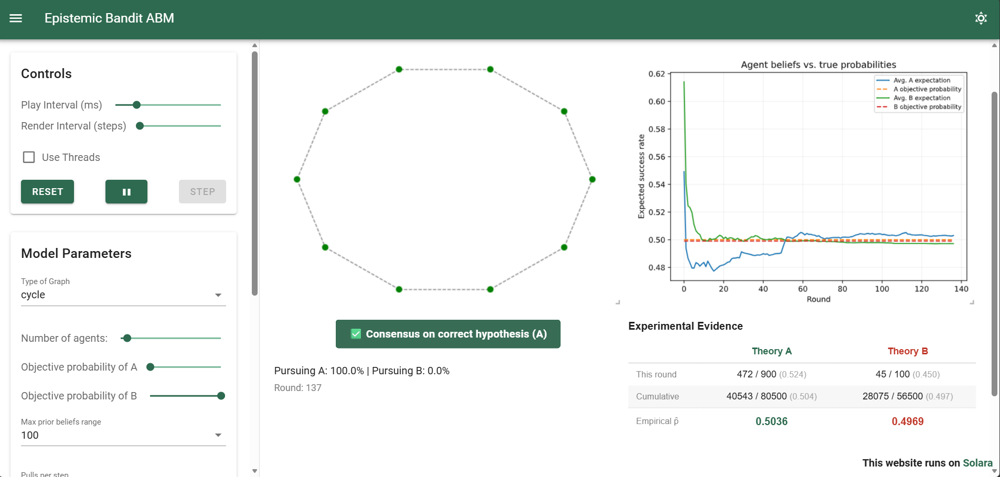
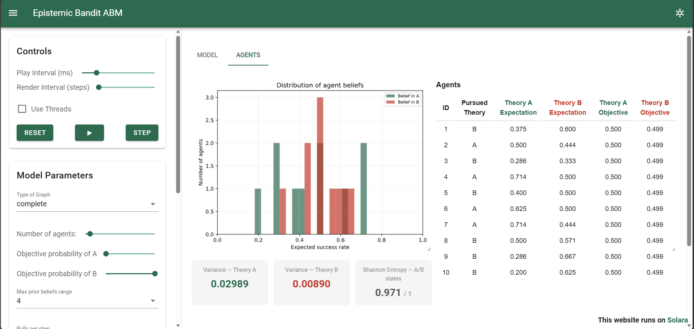
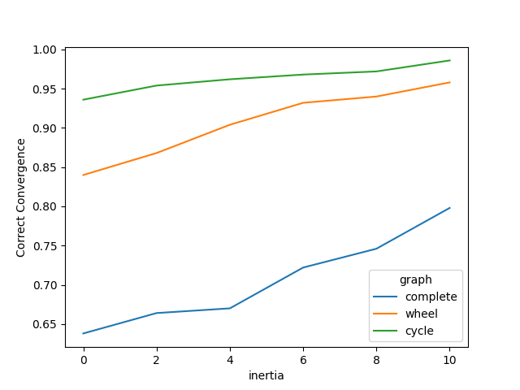
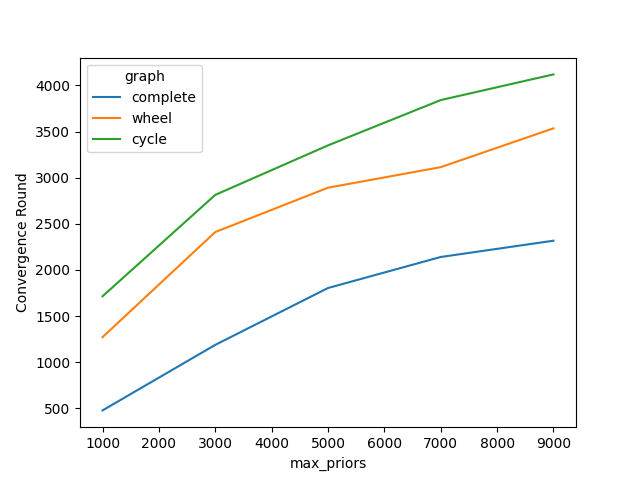
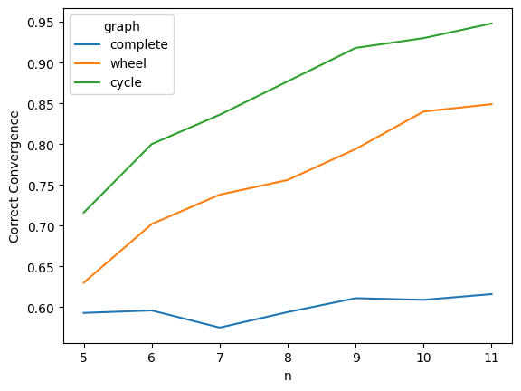
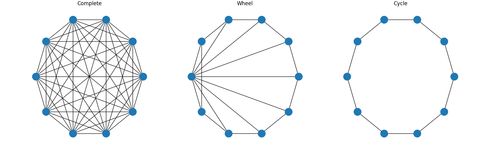

# Epistemic Bandit ABM — Replication Package

[](https://doi.org/10.5281/zenodo.20268329)

An agent-based replication package for epistemic network models in philosophy of science. Implements and replicates three key papers studying how the structure of scientific communities affects their collective ability to converge on correct theories, using a multi-armed bandit framework. Includes an interactive Solara dashboard for model exploration and batch run scripts for statistical analysis.

**No install dashboard runner with Binder**
[](https://mybinder.org/v2/gh/sprologuglie/Interactive-Epistemic-ABM-Zollman-Using-Mesa/main?urlpath=lab/tree/interactive_model.ipynb)

---

## Dashboard



*Simulation tab: network visualization, belief trajectory, convergence indicator, and experimental evidence.*



*Agent Analytics tab: per-agent belief table, diversity metrics, and belief distribution.*

---

## Batch run



*An example of a plot with correct convergence rates of different inertia values per graph types*



*An example of a plot with convergence speed of different max priors values per graph type*

---

## Replicated papers



*An example of a plot showing the Zollman effect*

### Zollman (2010)
**Claim:** Less connected networks of scientists converge more frequently on the correct hypothesis than more connected ones (called the "Zollman effect"). Conversely, as prior beliefs become more extreme, less connected networks converge less frequently.

> Zollman, K. J. S. (2010). The Epistemic Benefit of Transient Diversity. *Erkenntnis*, 72(1), 17–35.

### Rosenstock, Bruner & O'Connor (2017)
**Claim:** The Zollman effect is not robust: it diminishes as the difference between objective probabilities increases, as experimental sample size increases, or as community size increases.

> Rosenstock, S., Bruner, J., & O'Connor, C. (2017). In Epistemic Networks, Is Less Really More? *Philosophy of Science*, 84(2), 234–252.

### Frey & Šešelja (2020)
**Claim:** Extensions of the basic model (dynamic objective probabilities, critical interaction, rational inertia, and theory threshold) differentially affect convergence speed in complete and cycle networks.

> Frey, D., & Šešelja, D. (2020). What is the epistemic function of highly idealized agent-based models of scientific inquiry? *Philosophy of the Social Sciences*, 50(4), 347–365.

---

## The model

### Background

The model represents an **epistemic community**: a group of scientists choosing between two competing research programs, A and B. Program A has a slightly higher *objective* probability of producing successful experimental results, making it the correct theory. The key question is whether the community converges on A, and how quickly and reliably it does so depending on how scientists communicate.

The setup is a **multi-armed bandit problem**: agents repeatedly "pull" one of two levers (A or B) and observe outcomes. Unlike classical bandit problems, agents share results with their network neighbors and update their beliefs via Bayesian inference.

### Agent step cycle

At each round, every scientist performs three operations in sequence:

```
1. RESEARCH     Sample from Binomial(step_pulls, objective_prob)
                → produces (successes, trials)

2. COMMUNICATE  Share own results with network neighbors
                Receive neighbors' results

3. UPDATE       Apply Bayesian update to prior beliefs
                (own evidence + all neighbors' evidence)
                → decide whether to switch theory
```

### Belief representation

Each agent maintains a **Beta distribution** for each theory, parameterised by (α, β):

- **α** accumulates experimental successes
- **β** accumulates experimental failures
- The **expected success rate** for theory X is α_X / (α_X + β_X)

At initialisation, α and β are sampled uniformly from (0, `max_priors`], producing agents with heterogeneous prior beliefs. Agents prefer the theory with the higher expected success rate.

### Theory switching

After updating beliefs, an agent switches from theory A to B (or vice versa) only if the competing theory's expected success rate exceeds the current theory's by more than `theory_threshold`. With `inertia > 0`, the agent must observe this condition for `inertia` consecutive rounds before switching.

### Network structure

Scientists are arranged on a network. At each step, agents share experimental results only with their **direct neighbors**. Three topologies are supported:

| Graph | Connectivity | Description |
|---|---|---|
| `complete` | Maximum | Every agent communicates with every other |
| `wheel` | Medium | One central hub connected to all; outer ring |
| `cycle` | Minimum | Each agent connected only to two neighbors |



### Extensions

The model supports three extensions from Frey & Šešelja (2020):

**Dynamic objectives** (`dynamic`): every n = `dynamic` rounds, the objective probability of A is nudged slightly toward 1, and B toward 0, representing the gradual unveiling of the true superiority of A. This models scientific progress in which the better theory becomes increasingly easier to distinguish.

**Critical interaction** (`criticism`): agents who observe a neighbor pursuing the competing theory with convincing results slightly modify their own experimental setup in response. Concretely, an agent on A whose neighbor on B achieves results above A's expected success rate increases A's objective probability slightly — a form of motivated refinement.

**Rational inertia** (`inertia`): agents require n = `inertia` consecutive rounds of counter-evidence before switching theories, modelling a conservative disposition toward established research programs.

---

## Parameters

| Parameter | Type | Default | Description |
|---|---|---|---|
| `n` | int | 10 | Number of scientist agents |
| `a_objective` | float [0.5, 1] | 0.5 | True success rate of theory A |
| `b_objective` | float [0, 0.5] | 0.499 | True success rate of theory B |
| `max_priors` | int | 4 | Upper bound for prior belief initialisation. Higher values → more spread in initial beliefs |
| `graph` | str | `complete` | Network topology: `complete`, `wheel`, `cycle` |
| `step_pulls` | int | 1000 | Experiments per agent per step. More pulls → faster, more reliable learning |
| `theory_threshold` | float | 0 | Evidence margin required to switch theories. Higher values → more conservative agents |
| `inertia` | int | 0 | Consecutive rounds of counter-evidence required before switching. 0 = switch immediately |
| `dynamic` | int or None | None | Rounds between objective probability updates. None = disabled |
| `criticism` | bool | False | Enable critical interaction between agents |
| `seed` | int or None | None | Random seed for reproducibility. None = random each run |

### Parameter interactions

**`a_objective` and `b_objective`** determine the *difficulty* of the problem. When the two values are close (e.g. 0.5 vs 0.499), agents struggle to distinguish the theories and convergence is slow and uncertain. Larger differences (e.g. 0.6 vs 0.4) make convergence faster and reduce the relevance of network structure.

**`step_pulls`** controls the reliability of each experimental round. More pulls reduce sampling noise, which according to Rosenstock et al. (2017) weakens the Zollman effect: when evidence is very reliable, network structure matters less.

**`theory_threshold` and `inertia`** both introduce conservatism but through different mechanisms. `theory_threshold` requires a *minimum advantage* before switching; `inertia` requires a *sustained advantage* over multiple rounds. They can be combined.

**`dynamic` and `criticism`** (Frey & Šešelja extensions). Both modify the objective probalities of A and B approaching 1 and 0 respectively. They follow the intuition that as research continues the truth become easier to distinguish. `dynamic=100` replicates their setting of objective updates every 100 rounds.

---

## Repository structure

```
├── src/                            # Model's scripts
│   └── epistemic_abm/
│       ├── __init__.py
│       ├── agent.py
│       ├── model.py
│       └── app.py
│
├── interactive_model.py            # Entrypoint: solara run interactive_model.py
│
├── batch_run.py                    # Example batch run script (reproduce Zollman effect)
├── batch_run.ipynb                 # Notebook version of the batch run script
│
├── replications/                   # Replication notebooks
│   ├── Zollman_replication.ipynb
│   ├── Rosenstocketal_replication.ipynb
│   └── Frey_Seselja_replication.ipynb
│
├── tests/                          # Test suite
│   ├── test_model.py               # Tests for interactive model
│   └── test_batch_run_model.py     # Tests for batch run model
│
├── .github/workflows/ci.yml
├── pyproject.toml
├── assets/                         # README images
├── CITATION.cff
├── CONTRIBUTING.md
├── LICENSE
└── requirements.txt
```

---

## Installation

```bash
git clone https://github.com/sprologuglie/Interactive-Epistemic-ABM-Zollman-Using-Mesa
cd Interactive-Epistemic-ABM-Zollman-Using-Mesa
pip install -r requirements.txt
```

**Requirements:** Python 3.11+, Mesa 3.x, Solara, NetworkX, NumPy, pandas, seaborn, matplotlib.

---

## Usage

### Interactive dashboard

```bash
solara run interactive_model.py
```

The dashboard opens in the browser and provides two views:

**Simulation tab** - network visualization (agents colored green for A, red for B), belief trajectory plot with true probabilities as reference, convergence indicator badge, and experimental evidence summary.

**Agent Analytics tab** - per-agent belief table updated at each step, aggregate diversity metrics (variance of beliefs, Shannon entropy of A/B distribution), and a belief distribution histogram.

Results can be exported as a `.zip` archive containing model metrics (CSV), agent metrics (CSV), run parameters (JSON), and a plain-text summary.

> **IMPORTANT**: remember to press **Reset** before changing parameters to ensure the new configuration takes effect.

### Replication notebooks

Open the notebooks in `replications/` with Jupyter. Read the notebook to see replications results.


> ⚠️ Replication batch runs use 1000 iterations per parameter combination and may take several hours depending on hardware.

### Batch run scripts

`batch_run.py` provides a configurable starting point for custom batch analyses. Results are saved as timestamped CSV files in `batch_run/outputs/`:

```bash
python batch_run.py
```

### Tests

```bash
pytest tests/
```

The test suite covers model initialisation, graph topologies, convergence logic, parameter behaviour, and edge cases for both model versions.

---

## Differences from original models

| Feature | Zollman (2010) | Rosenstock et al. (2017) | Frey & Šešelja (2020) | This model |
|---|---|---|---|---|
| Network topologies | complete, cycle, wheel | complete, cycle | complete, cycle | complete, cycle, wheel |
| Dynamic objectives | — | — | ✓ | ✓ (+ parametric) |
| Critical interaction | — | — | ✓ | ✓ |
| Rational inertia | — | — | ✓ | ✓ (+ parametric) |
| Theory threshold | — | — | ✓ | ✓ (+ continuous) |
| Interactive dashboard | — | — | — | ✓ |

**Parameter mapping notes:**
- `dynamic`: Frey & Šešelja use a boolean activating updates every 100 rounds. Equivalent setting: `dynamic=100`.
- `theory_threshold`: Frey & Šešelja use a boolean mapped to a fixed value of 0.1. Here the parameter is a continuous float, enabling finer control. Equivalent setting `theory_threshold=0.1`

---

## Citation

If you use this package in your research, please cite:

```bibtex
@software{Replicating Zollman's (and others) Network Epistemology: Open-Source Agent-Based Model, Batch Runner, and Interactive Dashboard,
  author    = {Guglielmo Sprolquio},
  title     = {Epistemic Bandit ABM — Replication Package},
  year      = {2026},
  publisher = {Zenodo},
  doi       = {https://doi.org/10.5281/zenodo.20268329}
}
```

See [`CITATION.cff`](CITATION.cff) for full citation metadata.

---

## Contributing

See [`CONTRIBUTING.md`](CONTRIBUTING.md) for guidelines.

---

## License

MIT — see [`LICENSE`](LICENSE) for details.

